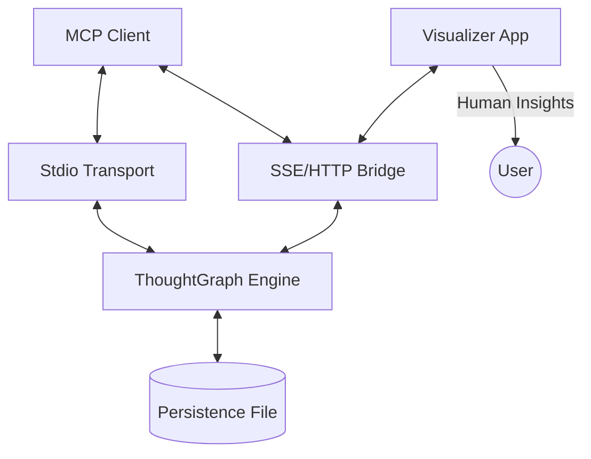

# GEMINI.md — Thought Graph v4.4.1 (Source of Truth)

## 🚀 Overview
**Thought Graph** is a 2026-era MCP server implementing the **Graph of Thoughts (GoT)** reasoning pattern (Besta et al., 2023). It enables non-linear, recursive reasoning for AI agents through a DAG structure with branching, aggregation, pruning, and convergence.

**Version:** 4.4.1 | **License:** MIT | **Transport:** Stdio + HTTP Bridge

## 🛡️ Hybrid 2026 Standard
This project adheres to the **Hybrid 2026 Visualization Standard** for maximum efficiency and accessibility:

1.  **Mermaid Structure (AI-to-AI)**: All architectural and logical flows in documentation (`.md`) MUST use Mermaid diagrams. This ensures AI agents can "see" and "modify" the logic via text.
2.  **Lean Visualizer (Human-to-AI)**: The actual dashboard uses a **Svelte 5 + Sigma.js v3 (WebGL)** stack to provide humans with fluid, hardware-accelerated insights into complex reasoning chains (100k+ nodes).

## 🛠 Tech Stack
| Component | Technology | Status |
|-----------|------------|--------|
| **Server** | TypeScript, Node.js v22+, `@modelcontextprotocol/sdk` ^1.26 | **STABLE** |
| **Documentation** | **Mermaid.js**, GitHub-Flavored Markdown | **STANDARD** |
| **Visualizer (Target)** | **Svelte 5 (Runes), Sigma.js v3 (WebGL), CSS Anchor Positioning** | **IN-PROGRESS** |
| **Visualizer (Legacy)** | React 19, Vite 7, `@xyflow/react`, Dagre, SWR | **DEPRECATED** |
| **Persistence** | Atomic reactive JSON mirroring with asynchronous save queue (< 100ms) | **STABLE** |
| **Transport** | Stdio (IDE agents) + HTTP Bridge :3001 (visualizer) | **STABLE** |

## 🏗 Architecture & Codebase Map



```
src/
├── index.ts                  # Bootstrap: Stdio MCP + Express HTTP bridge
├── server/
│   ├── mcp.ts                # Main MCP registration logic
│   ├── http.ts               # Express REST API + CORS for visualizer
│   └── tools/                # Specialized tool modules (23 tools total)
├── graph/
│   ├── ThoughtGraph.ts       # Core DAG engine (GoT primitives)
│   └── Persistence.ts        # Atomic asynchronous I/O
├── types.ts                  # ThoughtNode, ThoughtEdge, ThoughtRelation, GraphState
└── resources/                # MCP resource: thought-graph://current

visualizer/                   # [MIGRATING to Svelte 5]
├── src/App.tsx               # Legacy React 19 Entry
└── src/components/           # Custom XYFlow components
```

## 🧠 MCP Tools (23 total)

### Core Tools (v1.0)
| Tool | Description | Annotations |
|------|-------------|-------------|
| `propose_thought` | Propose a reasoning node with optional parent edge | `destructiveHint: true` |
| `evaluate_thought` | Score/critique a node (0.0–1.0). Omit score → autonomous audit | `destructiveHint: true` |
| `get_thought_graph` | Retrieve entire graph state as JSON | `readOnlyHint: true` |
| `reset_graph` | Clear all nodes and edges | `destructiveHint: true` |
| `generate_perspectives` | **NEW v4.3.0**: Heuristic auto-seeding of reasoning branches | `readOnlyHint: true` |

### GoT Primitives (v3.0)
| Tool | Description | Annotations |
|------|-------------|-------------|
| `aggregate_thoughts` | Merge 2+ nodes → synthesized conclusion | `destructiveHint: true` |
| `prune_branch` | Recursively reject a node + ALL descendants | `destructiveHint: true` |
| `find_winning_path` | Greedy DFS/Beam Search: k-best paths from root to leaf | `readOnlyHint: true` |
| `get_graph_metrics` | Retrieve live metrics: node count, max depth, prune ratio, etc. | `readOnlyHint: true` |

### Self-Reflection & Context Store (v4.0)
| Tool | Description | Annotations |
|------|-------------|-------------|
| `reflect_and_refine` | Self-reflection: 4-axis confidence + auto-critique + branch | `destructiveHint: true` |
| `context_set` | Write key-value to shared context store with provenance | `destructiveHint: true` |
| `context_get` | Read value + source from shared context store | `destructiveHint: true` |
| `context_list` | List all context store entries and their sources | `readOnlyHint: true` |

### Orchestration & Export (v3.0/v4.0)
| Tool | Description | Annotations |
|------|-------------|-------------|
| `export_snapshot` | Full graph serialization for deterministic replay/recovery | `readOnlyHint: true` |
| `restore_snapshot` | Replace graph state from previously exported snapshot | `destructiveHint: true` |
| `export_reasoning_trace` | Export winning path as Long CoT trace (R1 format) | `readOnlyHint: true` |
| `export_proven_memory` | Export path for `@mcp:memory` KG format | `readOnlyHint: true` |
| `commit_to_memory` | Permanent storage of validated insights | `destructiveHint: false` |
| `run_controller_loop` | Autonomous GoT loop orchestrator | `destructiveHint: true` |
| `compile_node_context` | SOTA Context Firewall: Filter lateral branches | `readOnlyHint: true` |
| `query_nodes` | Discovery filter for swarm orchestration tasks | `readOnlyHint: true` |
| `ingest_evidence` | Sanitized ingestion of cloud infrastructure JSON | `readOnlyHint: false` |

### Reporting & Analysis (v4.4.0)
| Tool | Description | Annotations |
|------|-------------|-------------|
| `generate_gap_report` | **NEW v4.4.0**: Professional SOC 2 Gap Analysis PDFs/Markdown | `readOnlyHint: true` |

### Relation Types
`refinement` · `contradiction` · `support` · `branch` · `aggregation` · `reflection`

### Node Statuses
`active` · `validated` · `rejected` · `branching`

## 🚦 Workflows

### Build & Run
```bash
npm install && npm run build    # Compile TypeScript
npm run start                   # Stdio + HTTP Bridge (:3001)
npm run dev                     # Watch mode
```

### Visualizer
```bash
cd visualizer && npm install
npm run dev                     # Vite dev server (:5173)
```

### Testing
```bash
npm run build                   # Must compile first
npm test                        # Run unit tests via node:test
```

## 📜 Conventions & Standards

### MCP Builder Compliance
- ✅ **Zod schemas** on all tool inputs with `.describe()` annotations
- ✅ **Actionable error messages** with specific node IDs and suggestions
- ✅ **Singleton state** via `getGraphInstance()` (Stdio + HTTP share same graph)
- ✅ **Tool annotations** (`readOnlyHint` / `destructiveHint`)
- ✅ **outputSchema** — fully implemented for all tools

### Coding Standards
- ES6+, async/await, strict TypeScript (`strict: true`)
- **Hybrid 2026**: Mermaid diagrams in `.md`, Svelte 5 for dashboard
- Cross-process file sync via `fs.watchFile` + atomic temp-file writes

### Git Strategy
- Branches: `feat/`, `fix/`, `refactor/`, `docs/`, `chore/`
- Commits: Conventional Commits (`type(scope): description`)
- Default branch: `main`

## 🔭 GoT Compliance (Besta et al., 2023)
| Primitive | Status | Tool |
|-----------|--------|------|
| **Generate** | ✅ v1.0 | `propose_thought` |
| **Evaluate** | ✅ v1.0 | `evaluate_thought` |
| **Aggregate** | ✅ v3.0 | `aggregate_thoughts` |
| **Prune** | ✅ v3.0 | `prune_branch` |
| **Converge** | ✅ v3.0 | `find_winning_path` |
| **Self-Reflect** | ✅ v4.0 | `reflect_and_refine` |
| **Controller Loop** | ✅ v4.0 | `run_controller_loop` |

## 📁 Config & Environment
- **Env:** `THOUGHT_GRAPH_HTTP_PORT` (default: 3001)
- **State file:** `thought-graph-state.json` (CWD of the server process)
