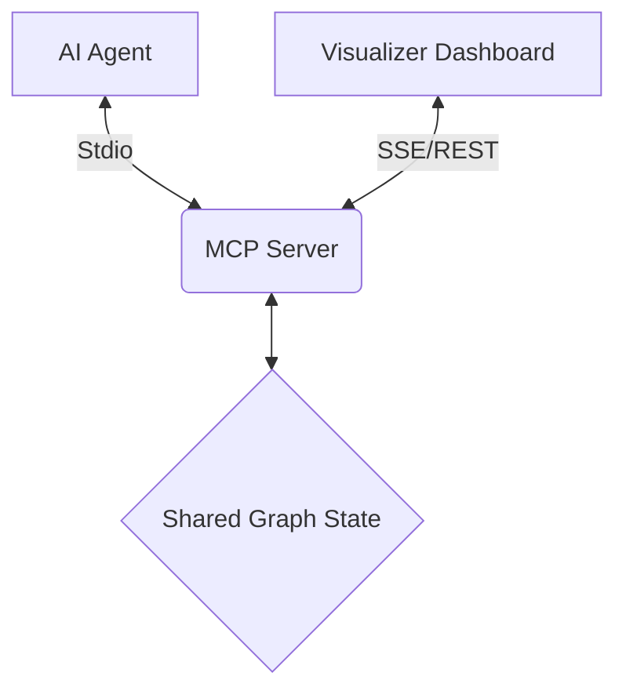

# Thought Graph (GoT) MCP Server

## 🚀 Overview
**Thought Graph** is a high-performance Model Context Protocol (MCP) server designed for recursive, non-linear reasoning. It was custom-engineered in 2026 to supersede traditional linear "Chain of Thought" (CoT) and hierarchical "Tree of Thoughts" (ToT) frameworks.

By representing reasoning as a **Directed Acyclic Graph (DAG)** with support for cycles and transformations, this server allows AI agents to perform complex architectural planning, deep debugging, and multi-variable optimization.

---

## 🧠 Why Graph of Thoughts (GoT)?
Traditional reasoning tools (like `sequential-thinking`) are often restricted to linear paths. **Thought Graph** introduces three critical 2026-era logic patterns:
1. **Aggregration**: Merging three separate sub-thoughts into one unified conclusion.
2. **Backtracking & Refinement**: Revisiting a previous node to update it based on "future" discoveries.
3. **Contradiction Management**: Specifically marking thoughts that negate others to prevent logical hallucinations.

---

## 🛠 Tools Reference

### `propose_thought`
Creates a new node in the graph.
- `thought`: The actual reasoning text.
- `parentId`: (Optional) Connect to a specific previous thought.
- `relation`: 
  - `refinement`: Narrowing down a detail.
  - `contradiction`: Proving a previous thought wrong.
  - `support`: Adding evidence to a previous thought.
  - `branch`: Exploring a parallel alternative.

### `evaluate_thought`
Triggers a self-critique loop or autonomous audit.
- `nodeId`: The ID of the node to judge.
- `score`: (Optional) 100% (1.0) means verified logic; 0% (0.0) means logical failure. **If omitted, triggers an autonomous LLM audit via MCP Sampling.**
- `status`: `validated`, `rejected`, or `branching` (needs more exploration).
- `critique`: Detailed reasoning for why this score was given.

### `get_thought_graph`
Exports the entire mental map as JSON for review or storage.

### `reset_graph`
Clears the current reasoning session, removing all nodes and edges from the graph. Useful for starting a fresh reasoning context.

---

## 📖 Case Study 1: Resolving a Distributed Systems Race Condition
**Scenario**: A microservice is dropping 0.1% of orders under high load.

1. **Node 1 (Propose)**: "Observed drop rate correlates with peak hours. Hypothesize database locking."
2. **Node 2 (Propose)**: "Check Redis lock expiration. Node 1 Parent."
3. **Node 3 (Evaluate Node 2)**: "Score 0.2. Critique: Redis logs show no lock timeouts. Rejecting hypothesis."
4. **Node 4 (Propose)**: "New branch from Node 1: Hypothesize network jitter in the VPC peering."
5. **Node 5 (Support Node 4)**: "Confirmed VPC logs show 504 Gateway Timeouts during same window."
6. **Final Node**: "Conclusion: Increase VPC peering throughput and implement jitter-based retries."

## 📖 Case Study 2: Designing a Carbon-Neutral Data Center
**Scenario**: Balance cooling efficiency with renewable energy uptime.

1. **Path A**: Focus on immersion cooling (High CAPEX, Low OPEX).
2. **Path B**: Focus on solar + battery storage (High CAPEX, High Space).
3. **Aggregation Node**: "Use Thought Graph to merge Path A and Path B. Results in a hybrid model using immersion cooling only during peak thermal hours to save battery life."

---

## 🏗 Technical Architecture

**Thought Graph** is built on a dual-transport architecture, allowing it to act as both a tool for an Agent and a data source for a Visualizer.

### Dual-Transport System
- **Stdio Transport**: Enables real-time reasoning loops within the AI Agent (e.g., Gemini, Claude).
- **SSE/HTTP Bridge**: A built-in Express server that provides a Server-Sent Events (SSE) stream and a REST API (`/api/graph`). This allows external dashboards to visualize the reasoning graph in real-time without interrupting the Agent's session.

### The Graph Model
The graph is managed as a singleton `ThoughtGraph` instance. It ensures that any node proposed by the Agent via Stdio is immediately reflected in the Visualization dashboard via SSE.

---

## 🛠 Installation & Modification
This is a **bespoke** MCP server created specifically for this workspace. 
- **Source**: `src/index.ts`
- **Build**: `npm run build`
- **Config**: Located in your `mcp_config.json`.

You can modify the `ThoughtGraph` class in `src/index.ts` to add features like "Recursive Search" or "Graph Pruning" at any time.
