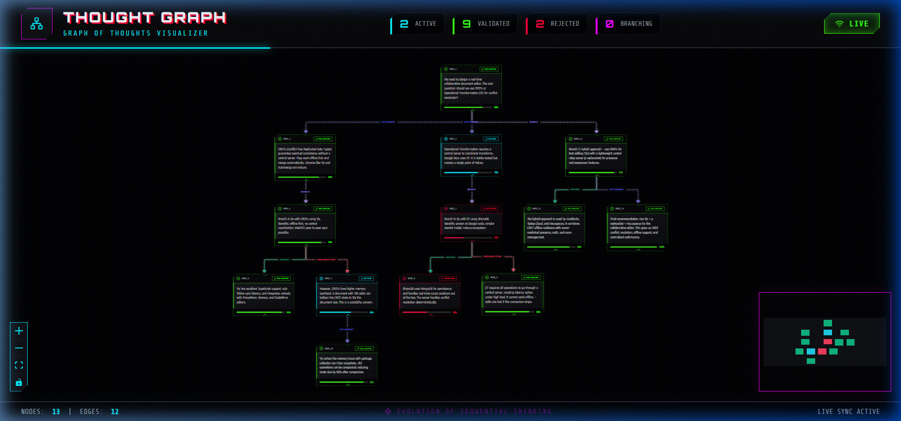
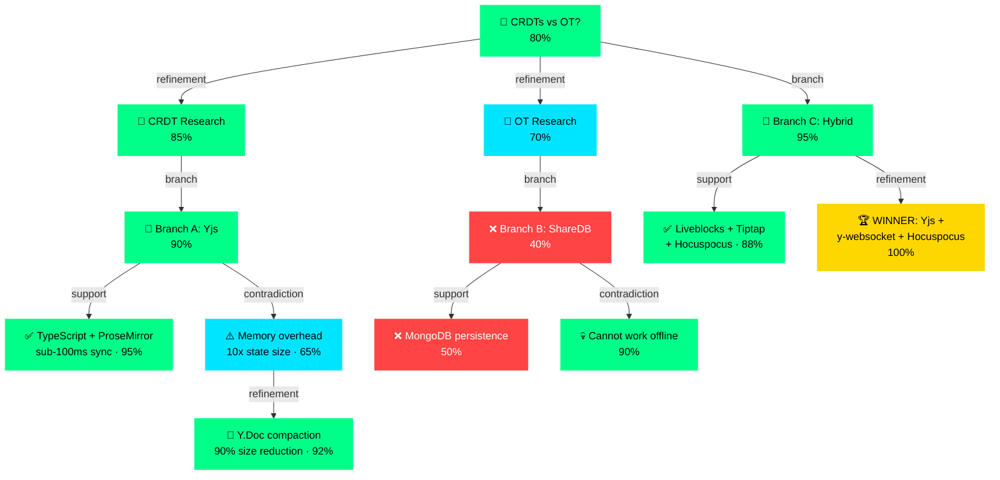

<p align="center">
  
</p>

<h1 align="center">🧠 GOT MCP</h1>

<p align="center">
  <strong>Graph of Thoughts MCP Server — Bounded, Auditable Reasoning for AI Agents</strong>
</p>

<p align="center">
  <a href="https://www.npmjs.com/package/@abderraouf-yt/got-mcp"></a>
  <a href="https://github.com/Abderraouf-yt/got-mcp"></a>
  <a href="#"></a>
  <a href="#"></a>
  <a href="#"></a>
  <a href="LICENSE"></a>
  <a href="https://arxiv.org/abs/2308.09687"></a>
</p>

<p align="center">
  <a href="#-quick-start">⚡ Quick Start</a> •
  <a href="#-tools-15">🛠 Tools</a> •
  <a href="#-how-it-thinks">🧬 How It Thinks</a> •
  <a href="#-governance">🔒 Governance</a> •
  <a href="#-visualizer">📊 Visualizer</a>
</p>

---

## What is this?

> **Chain of Thought** reasons in a line. **Tree of Thought** can branch. **Graph of Thoughts** can branch, merge, contradict, prune dead ends, and converge on the winning path.

Thought Graph is a [Model Context Protocol (MCP)](https://modelcontextprotocol.io) server that gives AI agents **non-linear reasoning** — a directed acyclic graph where thoughts can branch into alternatives, get contradicted by evidence, and converge through weighted aggregation.

```
Traditional AI:    A → B → C → D          (linear, no backtracking)
Tree of Thought:   A → B₁, B₂             (branching, no merging)  
Graph of Thoughts: A → B₁ ←contradiction→ C₁, B₂ →aggregate→ D  ← THIS
```

<table>
<tr>
<td width="33%" align="center"><strong>🔗 Chain of Thought</strong><br/>Linear • No backtrack</td>
<td width="33%" align="center"><strong>🌲 Tree of Thoughts</strong><br/>Branching • No merge</td>
<td width="33%" align="center"><strong>🧠 Graph of Thoughts</strong><br/>Branch • Merge • Prune • Converge</td>
</tr>
</table>

---

## ⚡ Quick Start

### Option 1: Install from npm

```bash
npm install -g @abderraouf-yt/got-mcp
```

### Option 2: Clone & Build

```bash
git clone https://github.com/Abderraouf-yt/got-mcp.git
cd got-mcp
npm install && npm run build
```

### Configure your IDE

Add to your MCP config (`~/.gemini/settings.json`, VS Code `mcp.json`, etc.):

```json
{
  "got-mcp": {
    "command": "npx",
    "args": ["-y", "@abderraouf-yt/got-mcp"],
    "env": { "THOUGHT_GRAPH_HTTP_PORT": "3001" }
  }
}
```

---

## 🎬 Live Demo

**Problem:** *"Should we use CRDTs or Operational Transformation for a collaborative editor?"*

The agent explored 3 branches, evaluated 13 nodes, rejected dead ends, and converged on a hybrid solution — all visible in the graph:



> **Result:** OT branch rejected (offline failure). CRDT memory concern contradicted then resolved via compaction. Hybrid path wins at 100%.

<details>
<summary>🔁 <strong>Load this demo yourself</strong></summary>

```bash
cp docs/assets/demo-state.json thought-graph-state.json
npm run start
# Open visualizer → http://localhost:5173
```

The demo state ships with the repo in `docs/assets/demo-state.json`.

</details>

---

## 🛠 Tools (15)

<table>
<tr><th>Tool</th><th>What it does</th><th>Category</th></tr>
<tr><td><code>propose_thought</code></td><td>Add a reasoning node with optional parent + relation</td><td>🧠 Core</td></tr>
<tr><td><code>evaluate_thought</code></td><td>Score (0.0–1.0) + critique. Omit score → autonomous LLM audit</td><td>🧠 Core</td></tr>
<tr><td><code>get_thought_graph</code></td><td>Retrieve the full DAG state</td><td>🧠 Core</td></tr>
<tr><td><code>reset_graph</code></td><td>Clear graph for new session</td><td>🧠 Core</td></tr>
<tr><td><code>aggregate_thoughts</code></td><td>Merge 2+ nodes → weighted synthesis <code>Σ(score×weight)/Σ(weights)</code></td><td>⚡ GoT</td></tr>
<tr><td><code>prune_branch</code></td><td>Hard (reject+zero) or Soft (score decay) pruning</td><td>⚡ GoT</td></tr>
<tr><td><code>find_winning_path</code></td><td>Greedy DFS or beam search (k-best paths) with threshold gating</td><td>⚡ GoT</td></tr>
<tr><td><code>get_graph_metrics</code></td><td>Node count, max depth, prune ratio, avg score, status breakdown</td><td>📊 Ops</td></tr>
<tr><td><code>export_snapshot</code></td><td>Full graph serialization for replay/recovery</td><td>🔁 Replay</td></tr>
<tr><td><code>restore_snapshot</code></td><td>Restore from previously exported snapshot</td><td>🔁 Replay</td></tr>
<tr><td><code>reflect_and_refine</code></td><td>Self-reflection: 4-axis confidence + auto-critique + branch</td><td>🔬 v4.0</td></tr>
<tr><td><code>context_set</code></td><td>Write key-value to shared context store with provenance</td><td>📦 v4.0</td></tr>
<tr><td><code>context_get</code></td><td>Read value + source from shared context store</td><td>📦 v4.0</td></tr>
<tr><td><code>context_list</code></td><td>List all context store entries and their sources</td><td>📦 v4.0</td></tr>
<tr><td><code>export_reasoning_trace</code></td><td>Export winning path as Long CoT trace (DeepSeek-R1/o3 format)</td><td>📤 v4.0</td></tr>
</table>

### Edge Relations

`refinement` · `contradiction` · `support` · `branch` · `aggregation` · `reflection`

### Node Statuses

`active` · `validated` · `rejected` · `branching`

---

## 🧬 How It Thinks

```
Agent: I need to decide between PostgreSQL and MongoDB.

→ propose_thought("PostgreSQL vs MongoDB for user data store?")
→ propose_thought("PostgreSQL: ACID, strong schema", parent: "node_1", relation: "branch")
→ propose_thought("MongoDB: flexible schema, horizontal scaling", parent: "node_1", relation: "branch")
→ propose_thought("Our data has relational patterns: user→orders→items", parent: "node_2", relation: "support")
→ propose_thought("MongoDB can't enforce referential integrity", parent: "node_3", relation: "contradiction")
→ evaluate_thought("node_3", score: 0.3, status: "rejected")
→ prune_branch("node_3", reason: "Relational data needs relational DB")
→ find_winning_path(beamWidth: 2, scoreThreshold: 0.5)
  ↳ Winner: node_1 → node_2 → node_4 (PostgreSQL path, score: 2.75)
```

---

## 🔒 Governance

Engine-level guards — enforced in the graph engine, not the tool layer:

| Guard | Default | Enforcement |
|-------|---------|-------------|
| **Node cap** | 200 | `addNode()` throws at limit |
| **Depth cap** | 15 | `addEdge()` validates depth |
| **Branch cap** | 5 children/node | `addEdge()` limits branching |
| **Cycle detection** | Always on | BFS reachability in `addEdge()` |
| **Thought length** | 5,000 chars | `addNode()` + Zod schema |
| **Aggregation limit** | 10 inputs | `aggregateNodes()` |
| **Prune cascade** | 50 nodes | `pruneFromNode()` |
| **Confidence clamp** | [0, 1] | `aggregateNodes()` |

<details>
<summary>⚙️ <strong>Custom Limits</strong></summary>

Override defaults via constructor:

```typescript
const graph = new ThoughtGraph(persistPath, {
  maxNodes: 500,
  maxDepth: 25,
  maxBranchFactor: 8,
  maxThoughtLength: 10000,
  maxAggregationInputs: 20,
  maxPruneCascade: 100,
});
```

</details>

### Session Isolation

Each session gets its own isolated graph with separate persistence:

```typescript
const alice = getGraphInstance("user-alice");  // → thought-graph-state-user-alice.json
const bob   = getGraphInstance("user-bob");    // → thought-graph-state-user-bob.json
// Alice and Bob never share state
```

### Concurrency Safety

All mutations run under an async mutex:

```typescript
await graph.withLock(async () => {
  graph.addNode("Safe concurrent mutation");
});
```

### Snapshot Replay

```typescript
const snapshot = graph.exportSnapshot();
// { nodes, edges, nodeCounter, timestamp, version: "3.0.0", stateVersion: 42 }

graph.restoreSnapshot(snapshot);  // Deterministic replay
```

---

## 📊 Visualizer

**[🌐 Live Demo →](https://got-mcp-visualizer.netlify.app)**

A React 19 + Vite dashboard with a **cyber-industrial UI** — real-time graph rendering via React Flow + Dagre layout.

| Feature | Detail |
|---------|--------|
| **Layout** | Dagre hierarchical DAG |
| **Live sync** | SWR polling (2s interval) |
| **Node colors** | 🟢 Validated · 🔵 Active · 🔴 Rejected · 🟣 Branching |
| **Edge types** | Animated (branch) · Dashed (contradiction) · Solid (support) · Dotted (aggregation) |
| **Score bars** | Per-node confidence (0–100%) |
| **Minimap** | Bottom-right overview |

```bash
cd visualizer && npm install && npm run dev
# → http://localhost:5173
```

### Architecture

```
┌─────────────────┐     Stdio      ┌──────────────────┐
│   AI Agent      │ ◄────────────► │  MCP Server      │
│ (Gemini/Cursor) │                │  (index.ts)      │
└─────────────────┘                │                  │
                                   │  Session Registry │
┌─────────────────┐    HTTP:3001   │  ThoughtGraph[]  │
│   Visualizer    │ ◄────────────► │                  │
│  React + Vite   │   /api/graph   │  Express Bridge  │
│  :5173          │                └──────────────────┘
└─────────────────┘                        │
                              thought-graph-state-{session}.json
                              (per-session file persistence)
```

---

## 🔬 GoT Compliance

Based on [Besta et al., 2023 — "Graph of Thoughts"](https://arxiv.org/abs/2308.09687):

| Primitive | Implementation | Version |
|-----------|---------------|---------|
| **Generate** | `propose_thought` | v1.0 |
| **Evaluate** | `evaluate_thought` | v1.0 |
| **Backtrack** | `evaluate_thought(status: rejected)` | v1.0 |
| **Aggregate** | `aggregate_thoughts` — weighted synthesis | v3.0 |
| **Prune** | `prune_branch` — hard + soft modes | v3.0 |
| **Converge** | `find_winning_path` — beam search | v3.0 |
| **Governance** | Engine-level guards + session isolation | v3.0 |
| **Replay** | `export_snapshot` / `restore_snapshot` | v3.0 |
| **Self-Reflect** | `reflect_and_refine` — 4-axis confidence | v4.0 |
| **Context Store** | `context_set` / `context_get` / `context_list` | v4.0 |
| **Reasoning Trace** | `export_reasoning_trace` — Long CoT export | v4.0 |
| Controller Loop | Roadmap | — |

---

## 🏗 Tech Stack

| Layer | Technology |
|-------|-----------|
| Runtime | TypeScript · Node.js v20+ |
| Protocol | `@modelcontextprotocol/sdk` ^1.26 |
| Validation | Zod schemas with `.max()` length guards |
| Governance | Engine-level: node/depth/branch caps, cycle detection |
| HTTP Bridge | Express |
| Visualizer | React 19 · Vite · `@xyflow/react` · Dagre · SWR |
| Persistence | Session-scoped JSON with `fs.watchFile` sync |
| Concurrency | Async mutex (`withLock`) per session |

## 📁 Structure

```
thought-graph/
├── src/
│   ├── index.ts              # Bootstrap (Stdio + HTTP)
│   ├── server/
│   │   ├── mcp.ts            # 15 MCP tool registrations
│   │   └── http.ts           # Express bridge (minimal inline CORS)
│   ├── graph/
│   │   ├── ThoughtGraph.ts   # Core DAG engine + governance
│   │   └── index.ts          # Session registry exports
│   ├── context/
│   │   ├── ContextStore.ts   # Shared context store (CA-MCP)
│   │   └── index.ts          # Context singleton export
│   └── types.ts              # GraphLimits, ConfidenceVector, ReasoningTrace
├── visualizer/               # React + Vite dashboard (local only)
├── evaluations/              # XML evaluation framework
├── tests/                    # Unit tests
├── docs/assets/              # Demo screenshots & state
└── dist/                     # Compiled output
```

## 📜 License

MIT

---

<p align="center">
  <sub>Evolution of sequential thinking — because the best ideas don't come in a straight line.</sub>
</p>
