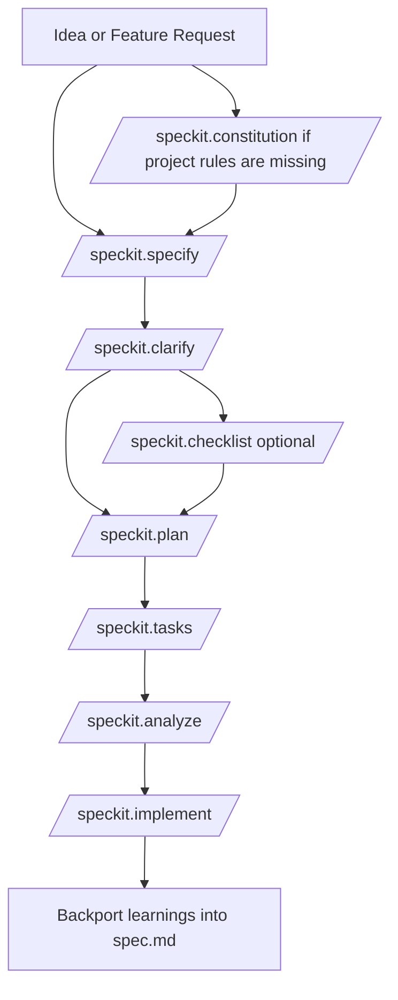

# Speckit SOP 2026

This Standard Operating Procedure explains how to use Speckit step by step for planning and building software with fewer mistakes.

The purpose of Speckit is simple:

- turn a vague request into a clear specification
- remove ambiguity before coding
- produce an implementation plan and task list
- keep the specification as the source of truth as the product evolves

## Core Rule

Do not write code until the feature is clear enough that another engineer could implement it from the spec and plan.

---

## Prerequisites

Before using this workflow, make sure you have:

- Speckit commands available in your environment
- a project folder or repository where Speckit can write its files
- a product idea, feature request, bug fix, or system change to define
- enough context to describe the user problem, business goal, and constraints

Helpful but optional:

- an existing `README.md`, architecture notes, or PRD
- examples of current user flows
- compliance, performance, or security requirements if they matter

---

## What Speckit Produces

During the workflow, Speckit usually creates or updates files such as:

- `constitution.md` or equivalent governance rules
- `spec.md` for product and feature requirements
- `plan.md` for architecture and technical decisions
- `tasks.md` for implementation steps
- checklist or analysis outputs that reveal missing requirements or conflicts

Use these files as the working source of truth. When the product changes, update them before or alongside code changes.

---

## Quick Decision Guide

| If you need to... | Use this command first | Why |
| :--- | :--- | :--- |
| Start a new project | `/speckit.constitution` | Define the project rules before designing features |
| Add a feature to an existing app | `/speckit.specify` | Describe the feature clearly before choosing the implementation |
| Resolve unclear requirements | `/speckit.clarify` | Expose missing decisions and force concrete answers |
| Validate the plan before coding | `/speckit.analyze` | Catch contradictions across the spec, plan, and tasks |
| Generate implementation work | `/speckit.tasks` then `/speckit.implement` | Break work into steps, then execute those steps |

---

## Minimum Happy Path

If you only remember one workflow for an existing app, use this:

1. Run `/speckit.specify`
2. Run `/speckit.clarify`
3. Run `/speckit.plan`
4. Run `/speckit.tasks`
5. Run `/speckit.analyze`
6. Run `/speckit.implement`
7. Update `spec.md` with any lessons learned after implementation

This is the safest default path for most real product work.

---

## Workflow Diagram



---

## The Commands

### `/speckit.constitution`

Use when:

- starting a new project
- resetting standards on a messy project
- defining non-negotiable technical or compliance rules

Input:

- project type
- business constraints
- engineering constraints
- required standards such as TypeScript strictness, testing expectations, accessibility, privacy, or compliance

Expected output:

- a governance file that defines project rules and non-negotiable standards
- clear guardrails for future planning and coding

Example prompt:

```text
/speckit.constitution Create the constitution for a B2B SaaS product. Use strict TypeScript, server-side secrets only, audit logging for admin actions, and accessibility as a release requirement.
```

Real-world use cases:

- starting a multi-tenant SaaS product for compliance workflows
- creating standards for an internal platform team
- defining rules for a health or fintech product with strict audit requirements

### `/speckit.specify`

Use when:

- defining a new feature
- documenting a product change for an existing app
- capturing business requirements before architecture decisions

Input:

- user problem
- target user
- business goal
- success criteria
- scope boundaries

Expected output:

- user stories
- functional requirements
- edge cases or open questions
- a feature definition without premature implementation detail

Example prompt:

```text
/speckit.specify Add a customer-facing billing portal to the existing SaaS app. Users must be able to view invoices, update card details, and download receipts without contacting support.
```

Real-world use cases:

- adding a billing portal to an existing SaaS app
- adding SSO to an enterprise dashboard
- adding order tracking to an e-commerce platform

### `/speckit.clarify`

Use when:

- the request sounds simple but hides product risk
- multiple interpretations are possible
- failure cases, permissions, or edge cases are unclear

Input:

- the current spec
- any known constraints or open questions

Expected output:

- a list of unanswered questions
- clarified assumptions
- a more precise feature definition

Example prompt:

```text
/speckit.clarify Review this billing portal spec and ask the questions needed to make it implementation-ready.
```

Real-world use cases:

- deciding whether refunds are self-serve or admin-only
- clarifying tenant isolation rules in a B2B dashboard
- clarifying what should happen when a payment provider is unavailable

### `/speckit.checklist`

Use when:

- you want focused review against a risk area
- you need to pressure-test security, privacy, performance, or rollout concerns

Input:

- the current spec or clarified requirements
- a target topic such as security, compliance, accessibility, data migration, or performance

Expected output:

- a topic-specific review checklist
- a list of missing requirements or hidden risks

Example prompt:

```text
/speckit.checklist Security
```

Real-world use cases:

- verifying PII handling in a settings page
- checking authorization gaps in admin features
- validating rollout risks before touching payment flows

### `/speckit.plan`

Use when:

- the product requirements are stable enough to design the solution
- you need architecture, data flow, and integration decisions

Input:

- approved or clarified spec
- existing system constraints
- preferred stack, platform, or infrastructure constraints

Expected output:

- technical architecture
- component or service boundaries
- data model decisions
- API, storage, or integration choices
- implementation strategy

Example prompt:

```text
/speckit.plan Create the technical plan for the billing portal feature in our existing Node.js and Postgres SaaS app. Use Stripe for payments and keep customer card data out of our servers.
```

Real-world use cases:

- planning Stripe integration for subscription billing
- designing a document approval workflow with role-based access
- planning an audit trail and event model for enterprise actions

### `/speckit.tasks`

Use when:

- you need implementation broken into safe, ordered steps
- you want coding work split by dependency

Input:

- completed plan
- any delivery constraints such as phased rollout or no-schema-change requirements

Expected output:

- a dependency-ordered task list
- concrete engineering work items
- a basis for implementation or team assignment

Example prompt:

```text
/speckit.tasks Break the billing portal plan into dependency-ordered implementation tasks.
```

Real-world use cases:

- sequencing backend, webhook, and frontend work for payments
- splitting a feature across API, database, and UI tasks
- preparing a sprint-ready implementation checklist

### `/speckit.analyze`

Use when:

- you want a final consistency check before implementation
- you suspect the spec, plan, and tasks may disagree

Input:

- current `spec.md`
- current `plan.md`
- current `tasks.md`

Expected output:

- contradictions across documents
- missing tasks or requirements
- warnings about unclear assumptions
- recommendations before coding starts

Example prompt:

```text
/speckit.analyze Validate that the billing portal spec, technical plan, and tasks are aligned and implementation-ready.
```

Real-world use cases:

- catching a missing webhook task for subscription updates
- finding that the spec mentions SSO but the plan never covers identity provider mapping
- finding that tasks ignore accessibility or audit logging requirements

### `/speckit.implement`

Use when:

- the tasks are reviewed and approved
- you want the agent to begin executing implementation work

Input:

- reviewed `tasks.md`
- any execution instructions such as branch naming, testing expectations, or rollout limits

Expected output:

- code changes based on the task list
- staged implementation progress across the planned tasks
- follow-up issues if the plan needs adjustment during coding

Example prompt:

```text
/speckit.implement Implement the approved billing portal tasks in order. Run tests after each major phase.
```

Real-world use cases:

- implementing a scoped feature in an existing monolith
- executing a migration-backed workflow in phases
- building a new internal tool from a reviewed specification set

---

## Bulletproof Existing-App Use Cases

These examples represent common, high-value use cases where Speckit helps prevent costly mistakes.

### 1. Add a Billing Portal to an Existing SaaS App

Goal:

- reduce support tickets
- let users manage invoices and payment methods securely

Why Speckit helps:

- billing changes affect permissions, webhooks, failure handling, and compliance
- teams often jump into UI work before defining subscription edge cases

Recommended flow:

1. `/speckit.specify`
2. `/speckit.clarify`
3. `/speckit.checklist Security`
4. `/speckit.plan`
5. `/speckit.tasks`
6. `/speckit.analyze`
7. `/speckit.implement`

### 2. Add Role-Based Access Control to an Admin Dashboard

Goal:

- prevent unauthorized actions
- support different permissions for support, manager, and super-admin roles

Why Speckit helps:

- authorization bugs are expensive and easy to miss when requirements are vague
- role definitions usually affect UI, API, audit logs, and support workflows

Recommended flow:

1. `/speckit.specify`
2. `/speckit.clarify`
3. `/speckit.checklist Security`
4. `/speckit.plan`
5. `/speckit.tasks`
6. `/speckit.analyze`
7. `/speckit.implement`

### 3. Add Multi-Tenant Data Isolation to an Existing Platform

Goal:

- ensure each customer can only access its own data
- prepare the product for enterprise adoption

Why Speckit helps:

- tenant isolation affects schema design, APIs, jobs, exports, logs, and support tooling
- unclear assumptions here lead directly to security incidents

Recommended flow:

1. `/speckit.specify`
2. `/speckit.clarify`
3. `/speckit.checklist Security`
4. `/speckit.plan`
5. `/speckit.tasks`
6. `/speckit.analyze`
7. `/speckit.implement`

### 4. Add an Approval Workflow to an Internal Operations Tool

Goal:

- replace manual approvals in chat or email
- create auditability and repeatability

Why Speckit helps:

- approval workflows hide state transitions, notification rules, escalation rules, and exception handling

Recommended flow:

1. `/speckit.specify`
2. `/speckit.clarify`
3. `/speckit.checklist Compliance`
4. `/speckit.plan`
5. `/speckit.tasks`
6. `/speckit.analyze`
7. `/speckit.implement`

---

## Full Beginner Workflow

### Phase 1: Define project rules if they do not already exist

Command:

```text
/speckit.constitution
```

Use this phase if the project is new or if the team has not documented non-negotiable standards.

### Phase 2: Define the feature in product terms

Command:

```text
/speckit.specify
```

Focus on:

- who the user is
- what problem they have
- what the system must do
- what success looks like

Do not focus on libraries, frameworks, or database details yet.

### Phase 3: Remove ambiguity

Commands:

```text
/speckit.clarify
/speckit.checklist <topic>
```

Use this phase to force missing decisions into the open.

Good checklist topics:

- `Security`
- `Compliance`
- `Accessibility`
- `Performance`
- `Rollout`

### Phase 4: Design the implementation

Command:

```text
/speckit.plan
```

This is where technical choices belong.

Decide:

- services or modules involved
- data model changes
- APIs and integrations
- background jobs, events, or webhooks
- operational risks and mitigations

### Phase 5: Break the work into tasks

Command:

```text
/speckit.tasks
```

The result should be detailed enough that implementation work can proceed without major guesswork.

### Phase 6: Run a consistency check

Command:

```text
/speckit.analyze
```

Do not skip this on important features. This is where Speckit catches missing logic before code makes the problem expensive.

### Phase 7: Implement from reviewed tasks

Command:

```text
/speckit.implement
```

Only run this after the documents agree with each other.

### Phase 8: Backport learnings

After implementation, update the spec with any design decisions, hidden assumptions, or constraints discovered during coding.

Example prompt:

```text
Encode the implementation learnings and newly discovered assumptions back into spec.md.
```

This keeps the spec usable for future rewrites, audits, and new team members.

---

## Common Mistakes To Avoid

- starting with `/speckit.implement` before requirements are stable
- mixing product requirements and technical design in the same early step
- skipping `/speckit.clarify` because the feature sounds obvious
- treating `tasks.md` as complete without running `/speckit.analyze`
- shipping code changes without backporting important learnings into `spec.md`

---

## Advanced Integration

Use this only when the feature requires deeper reasoning than a normal product workflow.

### Thought Graph

Use Thought Graph during the clarification or planning stage when the problem has multiple competing approaches or hidden tradeoffs.

Examples:

- multi-tenant isolation strategy
- migration approach for legacy authorization rules
- deciding between synchronous and async processing for approvals

Suggested pattern:

1. pause after `/speckit.clarify`
2. reason through the hard design question in Thought Graph
3. capture the winning conclusion
4. feed that conclusion into `/speckit.plan`

### Manara

Use Manara when you want help choosing the right reasoning mode for a raw idea before entering the normal Speckit flow.

---

## One Real Example

Example request:

```text
We have an existing B2B SaaS app. Add a secure billing portal so account owners can update payment methods, download invoices, and see subscription status without contacting support.
```

Safe sequence:

1. `/speckit.specify`
2. `/speckit.clarify`
3. `/speckit.checklist Security`
4. `/speckit.plan`
5. `/speckit.tasks`
6. `/speckit.analyze`
7. `/speckit.implement`
8. update `spec.md` with billing edge cases discovered during implementation

What this prevents:

- forgetting webhook handling
- weak authorization around billing actions
- missing failure flows when payments fail
- unclear ownership rules for who can manage billing

---

## Final Recommendation

For most existing applications, default to this sequence:

```text
/speckit.specify
/speckit.clarify
/speckit.plan
/speckit.tasks
/speckit.analyze
/speckit.implement
```

Add `/speckit.checklist Security` or another targeted checklist whenever the feature touches money, permissions, customer data, or infrastructure risk.
