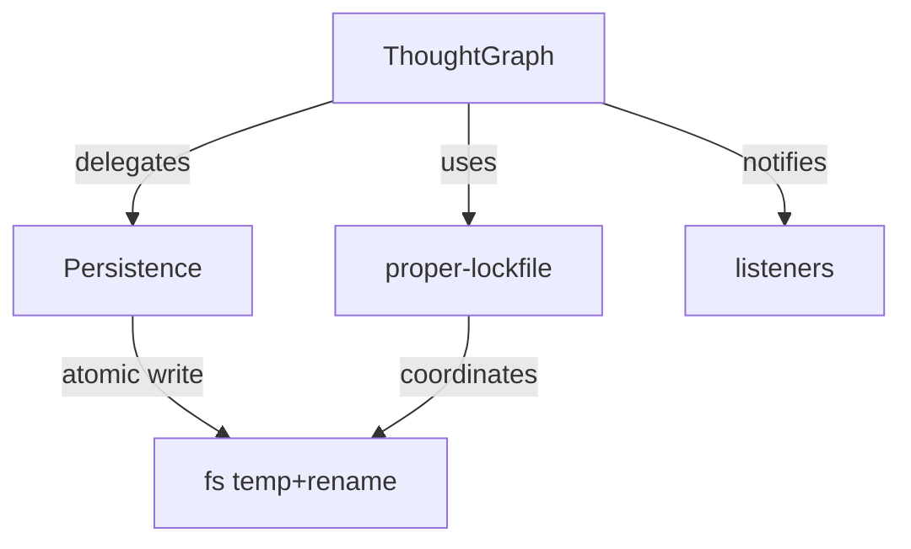

# AGENTS.md — Graph Engine (`src/graph/`)

> **Parent:** [../../../AGENTS.md](../../../AGENTS.md)

This directory contains the core DAG engine and its persistence layer.

---

## Architecture

## Key Files
| File | Responsibility |
| :--- | :--- |
| `ThoughtGraph.ts` | Core DAG: nodes, edges, GoT primitives, cycle detection, scoring |
| `Persistence.ts` | Atomic disk I/O: temp-write + rename, `loadSync()` |
| `index.ts` | Singleton registry: `getGraphInstance(sessionId?)` |

## Rules

### Mutations
- All state mutations MUST call `this.requestSave()` to queue an async disk write.
- Never mutate `this.nodes` or `this.edges` without going through a public method.
- Cycle detection runs on every `addEdge()` call. Do not bypass it.

### Persistence Contract
- Writes use a `temp file → rename` atomic pattern via `Persistence.ts`.
- `proper-lockfile` coordinates multi-process access (MCP stdio + HTTP bridge).
- `fs.watchFile` polls at 500ms for cross-process sync. This creates a persistent timer.

### Cleanup (CRITICAL)
- `ThoughtGraph` instances that use persistence **MUST** be closed via `await graph.close()`.
- `close()` drains the `saveQueue`, calls `fs.unwatchFile()`, and clears listeners.
- Failure to call `close()` will hang the Node.js event loop indefinitely.

### Batching
- Use `graph.beginBatch()` / `graph.endBatch()` for bulk mutations.
- Batching defers all disk writes until `endBatch()`, then flushes once.
