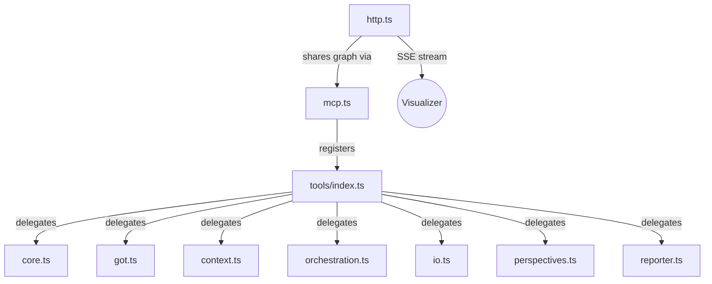

# AGENTS.md — Server Layer (`src/server/`)

> **Parent:** [../../../AGENTS.md](../../../AGENTS.md)

This directory contains the MCP server registration, HTTP bridge, and modular tool system.

---

## Architecture

## Key Files
| File | Responsibility |
| :--- | :--- |
| `mcp.ts` | Creates `McpServer`, registers resources, delegates tool registration |
| `http.ts` | Express REST API + CORS + SSE `/api/graph/stream` for visualizer |
| `logger.ts` | Structured logger with `info`, `warn`, `debug`, `error` levels |
| `logo.ts` | CLI brand logo output (Base64-encoded asset) |
| `tools/index.ts` | Barrel that calls all category `register*()` functions |
| `tools/*.ts` | Category files: `core`, `got`, `context`, `orchestration`, `io`, `perspectives`, `reporter` |
| `templates/` | Handlebars `.hbs` templates for gap report generation |

## Rules

### Adding a New Tool
1. Identify the correct category file in `tools/`.
2. Define a Zod input schema with `.describe()` on every field.
3. Define a Zod output schema.
4. Register via `server.tool(name, description, { inputSchema, outputSchema }, handler)`.
5. Add `annotations` with `readOnlyHint` or `destructiveHint`.
6. Handler MUST return `{ content: [...] }` — never throw. Use `isError: true` for failures.

### HTTP Bridge
- The Express server shares the same `ThoughtGraph` singleton as the Stdio MCP transport.
- SSE clients connect to `/api/graph/stream` and receive `data: { graph }` events.
- CORS is open (`*`) for local development. Restrict in production deployments.

### Templates
- Handlebars templates live in `templates/`. Modify `.hbs` files, not inline strings.
- Reporter tool (`reporter.ts`) compiles templates at runtime via `handlebars.compile()`.
