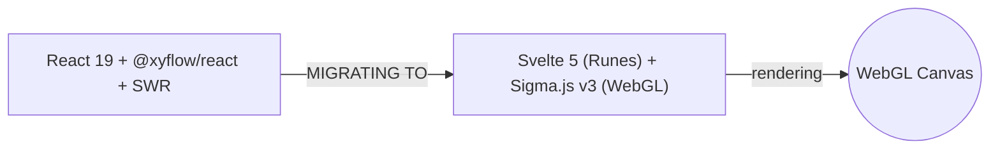

# AGENTS.md — Visualizer (`visualizer/`)

> **Parent:** [../AGENTS.md](../AGENTS.md)

This directory contains the user-facing dashboard for visualizing reasoning graphs.

---

## Migration Status



| Aspect | Legacy (Current) | Target (v5.0.0) |
| :--- | :--- | :--- |
| Framework | React 19, Vite 7 | Svelte 5 (Runes) |
| Graph Rendering | @xyflow/react, Dagre | Sigma.js v3 (WebGL) |
| Data Fetching | SWR polling | SSE stream (`/api/graph/stream`) |
| Styling | CSS Modules | CSS Anchor Positioning, View Transitions |

## Rules

### Current State (Legacy React)
- The existing code is **functional but deprecated**. Do not add new features to the React codebase.
- Bug fixes to the React code are acceptable only if the Svelte migration is not yet ready.

### Target State (Svelte 5)
- Use **Svelte 5 Runes** (`$state`, `$derived`, `$effect`) — no legacy `let` reactivity.
- Render graphs via **Sigma.js v3** on a WebGL canvas. Do not use SVG-based graph libraries.
- Minimize DOM manipulations. Offload layout computation to a Web Worker if >1000 nodes.
- Connect to the MCP server's SSE endpoint for real-time graph updates.

### Styling
- Use **CSS Anchor Positioning** for tooltip and panel placement relative to graph nodes.
- Use **View Transitions API** for smooth state changes (node expand/collapse, focus).
- Dark mode is the default theme. Support light mode as a toggle.

### Dev Server
```bash
cd visualizer && npm install
npm run dev    # Vite dev server on :5173
```
